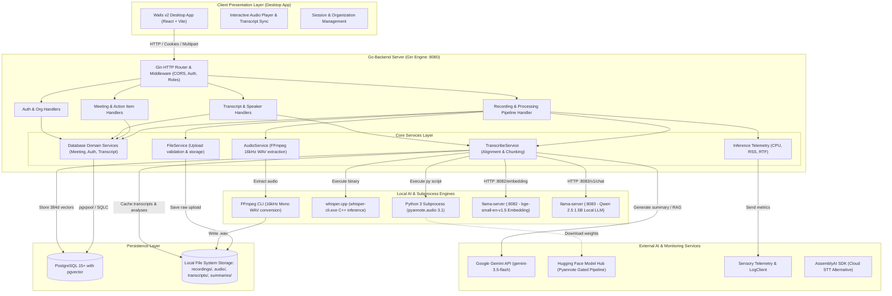
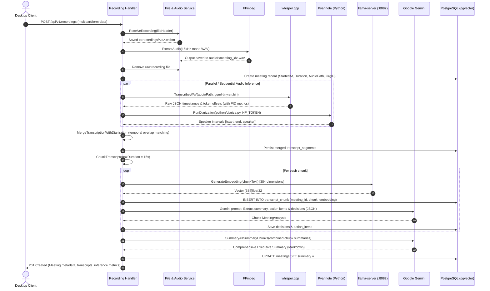
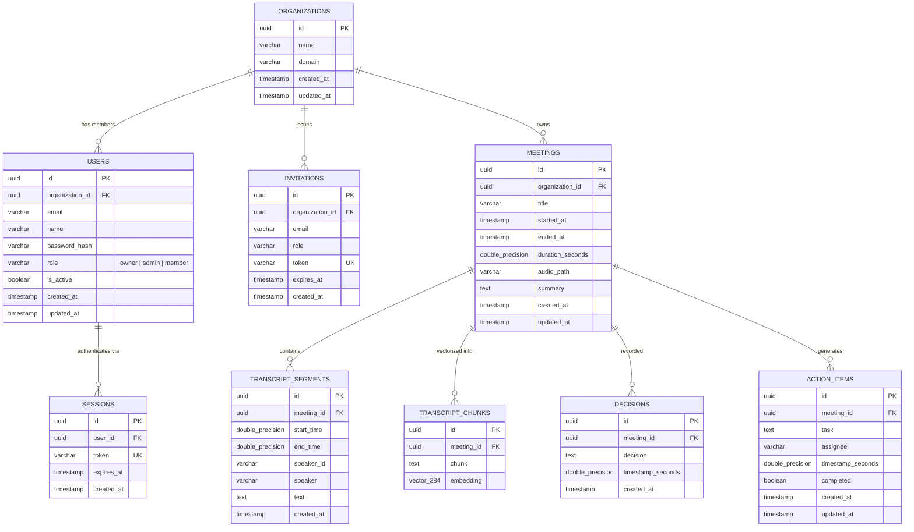

# AI Note Taker — System Architecture & Technical Design

This document details the architectural blueprint, data flow, component interactions, database schema, AI pipelines, and design decisions powering **AI Note Taker** (also referred to as *Afterword*). It is intended for onboarding developers and system maintainers.

---

## 1. System Overview

**AI Note Taker** is an intelligent meeting intelligence and transcription system that transforms screen/audio/video recordings into speaker-labeled, searchable transcripts, action items, executive summaries, and vector-searchable knowledge bases.

The system features a **hybrid local-first and cloud-assisted architecture**:
- **Local-First Processing:** Audio extraction (FFmpeg), speech-to-text inference (`whisper.cpp`), local neural speaker diarization (`pyannote.audio`), and local text embeddings (`llama.cpp` + `bge-small-en-v1.5`).
- **Cloud-Assisted Intelligence:** High-capacity LLM summarization and multi-chunk meeting synthesis using Google Gemini (with fallback/submodule support for local `llama.cpp` chat completions).
- **Relational & Vector Persistence:** PostgreSQL with `pgvector` for multi-tenant data, user sessions, transcript segments, meeting action items, decisions, and chunk embeddings.
- **Client Presentation:** A cross-platform desktop application built with [Wails v2](https://wails.io/) and React/Vite.

---

## 2. High-Level Architecture Diagram



---

## 3. End-to-End Processing Pipeline

When a user records or uploads a meeting via `POST /api/v1/recordings`, the backend executes an orchestrated 10-step pipeline:



### Detailed Pipeline Steps

1. **Ingestion & Validation:**
   - Handled by `FileService.ReceiveRecording`.
   - Validates file size against `MAX_RECORDING_BYTES` (default 100 MiB).
   - Generates a UUID and stores the raw upload into `RECORDINGS_DIR`.

2. **Acoustic Standardization (FFmpeg):**
   - Handled by `AudioService.ExtractAudio`.
   - Converts arbitrary audio/video formats (`.webm`, `.mp4`, `.m4a`, `.wav`) to single-channel (mono), 16,000 Hz, 16-bit PCM WAV.
   - Calculates duration and cleans up the temporary source recording.

3. **High-Performance Speech-to-Text (`whisper.cpp`):**
   - Executes compiled C++ binary `whisper-cli.exe` with GGML models (`ggml-tiny.en.bin` or `ggml-base.en.bin`).
   - Produces detailed millisecond-accurate offset intervals (`offsets.from`, `offsets.to`) and structured JSON.
   - Measures inference performance in real-time using `gopsutil` to calculate CPU utilization, RAM RSS, and Real-Time Factor ($RTF = \frac{T_{inference}}{T_{audio}}$).

4. **Neural Speaker Diarization (`pyannote.audio`):**
   - Calls `python/diarize.py` using Python 3.
   - Loads `pyannote/speaker-diarization-3.1` using `HF_TOKEN`.
   - Outputs segmented speaker turns (`SPEAKER_00`, `SPEAKER_01`, etc.) with start and end times in seconds.

5. **Temporal Alignment & Diarization Merging:**
   - Handled by `TranscribeService.MergeTranscriptionWithDiarization`.
   - Calculates the maximum intersection overlap between Whisper token timestamps and Pyannote intervals:
     $$\text{Overlap}(W, D) = \max\left(0, \min(W_{end}, D_{end}) - \max(W_{start}, D_{start})\right)$$
   - Assigns the dominant speaker to each text segment.
   - Persists all segments to `transcripts/<id>_transcript.json` and inserts into the `transcript_segments` database table.

6. **Semantic Chunking:**
   - Handled by `TranscribeService.ChunkTranscript`.
   - Groups contiguous speaker segments into duration-based windows (default 15 seconds) while respecting segment boundaries.

7. **Vector Embedding & Indexing (`llama.cpp` + `pgvector`):**
   - Runs `llama-server.exe` as a background embedding service on port `8082` with `bge-small-en-v1.5-q4_k_m.gguf`.
   - Emits a normalized 384-dimensional vector for each transcript chunk.
   - Stores the text and vector embedding into `transcript_chunk` in PostgreSQL for fast vector similarity searches.

8. **Chunk Analysis (Action Items & Decisions):**
   - Chunks are analyzed in parallel (with goroutines) via Google Gemini (`gemini-3.5-flash`).
   - The model is instructed with a strict JSON schema to extract:
     - Chunk summary
     - Tangible decisions made (with exact timestamp)
     - Assigned action items (with task, assignee, and timestamp)
   - Results are validated and written to `decisions` and `action_items` tables.

9. **Global Meeting Synthesis:**
   - All chunk summaries are synthesized into a cohesive document using `SummaryAllSummaryChunks`.
   - Generates structured sections: Overview, Detailed Discussion, Key Decisions, Action Items, Important Points, Open Questions, and Final Outcome.
   - Saved to `meetings.summary`.

10. **Semantic Q&A / RAG (`ChatWithTranscript`):**
    - Users can ask questions about any past meeting.
    - The question is embedded using the 384-dimensional model.
    - PostgreSQL runs a vector distance search (`embedding <=> queryEmbedding`) to retrieve the top 5 relevant transcript chunks.
    - Retrieved chunks form the context prompt for Gemini to provide grounded, hallucination-free answers.

---

## 4. Technology Stack

| Layer | Technology | Purpose |
|---|---|---|
| **Backend Framework** | Go 1.26+, Gin Web Framework | HTTP REST API, concurrency, process orchestration |
| **Database & ORM** | PostgreSQL 15+, pgx/v5, SQLC | Relational storage, type-safe query generation |
| **Vector Search** | pgvector (`vector(384)`) | Semantic similarity search and RAG retrieval |
| **Speech-to-Text** | `whisper.cpp` (C++ GGML) | Local, fast, hardware-accelerated transcription |
| **Diarization** | Python 3, `pyannote.audio` 3.1 | Local neural speaker identification |
| **Local LLM & Embeddings** | `llama.cpp` (`llama-server.exe`) | Local embedding server (`bge-small-en-v1.5`) & local chat model (`qwen2.5-1.5b`) |
| **Cloud LLM** | Google Gemini (`genai` SDK) | Chunk information extraction & global meeting synthesis |
| **Audio Processing** | FFmpeg (`ffmpeg-go`) | Transcoding, channel downmixing, 16kHz resampling |
| **Desktop Client** | Wails v2, React, Vite | Native Windows desktop application with web frontend |
| **Logging & Telemetry** | Sensory LogClient, `gopsutil` | Centralized telemetry, Whisper inference profiling |

---

## 5. Database Schema & Data Models

The database schema is managed via SQL migrations located in `internal/db/migrations/` and compiled to type-safe Go code using `sqlc`.



---

## 6. Project Layout & Directory Structure

```text
ai_note_taker/
├── cmd/
│   └── main.go                 # Application bootstrap & dependency injection
├── internal/
│   ├── auth/                   # Password hashing, JWT/token utilities
│   ├── config/                 # Config loader (.env), Gemini AI client, Sensory logger
│   ├── db/
│   │   ├── migrations/         # Up/Down SQL schema migrations (000001 - 000006)
│   │   ├── queries/            # Raw SQL queries consumed by sqlc
│   │   ├── sqlc/               # Generated type-safe Go database interfaces
│   │   └── postgres.go         # pgxpool connection pool initialization
│   ├── diarization/            # Subprocess wrapper for Python diarization script
│   ├── handlers/               # Gin HTTP request/response controllers
│   │   ├── auth_handler.go     # Login, setup, invitations, user administration
│   │   ├── meeting_handler.go  # CRUD for meetings, action items, decisions
│   │   ├── recording_handler.go# Multipart upload & AI processing pipeline
│   │   └── transcript_handler.go# Transcript segments & speaker renaming
│   ├── inference/              # Whisper runtime profiling (CPU, RAM, RTF via gopsutil)
│   ├── llama/                  # llama.cpp server manager (embedding & LLM endpoints)
│   ├── middleware/             # Session authentication & role-based access control
│   ├── repository/             # Data access layers wrapping sqlc queries
│   ├── router/                 # Gin route registration & CORS configuration
│   ├── services/
│   │   ├── audio_service.go    # FFmpeg audio conversion to 16kHz mono WAV
│   │   ├── file_service.go     # Multipart file streaming & size verification
│   │   ├── transcribe_service.go # Alignment, chunking, embeddings, Gemini summarization
│   │   └── db/                 # DB-specific domain services (Auth, Meeting, Transcript)
│   └── transcription/          # AssemblyAI client & standalone Whisper runners
├── desktop/
│   └── client/                 # Wails v2 Desktop Application
│       ├── app.go              # Wails runtime bridge
│       ├── main.go             # Desktop client entrypoint
│       ├── wails.json          # Wails build configuration
│       └── frontend/           # React + Vite frontend application
│           ├── src/
│           │   ├── App.jsx     # Main workspace, meeting dashboard & audio player
│           │   ├── Login.jsx   # Authentication UI
│           │   └── services/api.js # Centralized client API communication layer
├── python/
│   └── diarize.py              # Pyannote 3.1 neural speaker diarization script
├── whisper/whisper.cpp/        # Submodule: Whisper inference engine
├── llama/llama.cpp/            # Submodule: LLaMA & embedding server
├── audio/                      # Generated 16kHz WAV audio storage
├── recordings/                 # Temporary storage for raw incoming uploads
├── transcripts/                # Merged transcript JSON caches
├── summaries/                  # Generated meeting analysis JSON outputs
├── .env.example                # Example environment variable template
├── env.example                 # Duplicate reference template
└── sqlc.yaml                   # SQLC configuration with pgvector overrides
```

---

## 7. Authentication, Multi-Tenancy & Authorization

The platform implements an **Organization-scoped Multi-Tenant Model**:

1. **Initial Workspace Setup (`POST /api/v1/auth/setup`):**
   - Registers the root organization, the administrator account (`role: "owner"`), and creates the initial tenancy.

2. **Session Authentication:**
   - Upon login (`POST /api/v1/auth/login`), an opaque UUID session token is created with a 7-day expiration.
   - The token is set as an `HttpOnly`, `SameSite=Lax` cookie named `session`.
   - Subsequent requests pass this cookie automatically (`credentials: 'include'`).

3. **Multi-Tenancy Guard:**
   - The `AuthMiddleware` verifies the session, fetches the user, and injects `user_id` and `organization_id` into the Gin context.
   - All meeting and transcript database queries filter on `organization_id` to guarantee tenant isolation.

4. **Role-Based Access Control (RBAC):**
   - **`owner` & `admin`:** Can issue team invitations (`/auth/invitations`), change user roles, and view all organization members.
   - **`member`:** Can record meetings, view transcripts, update assigned action items, and query meeting intelligence.

---

## 8. REST API Reference Summary

### Authentication (`/api/v1/auth`)
| Method | Endpoint | Access | Description |
|---|---|---|---|
| `POST` | `/auth/setup` | Public | Initialize organization and owner user |
| `POST` | `/auth/login` | Public | Authenticate user and issue session cookie |
| `POST` | `/auth/invitations/accept` | Public | Accept an invitation token and set password |
| `POST` | `/auth/logout` | Protected | Invalidate current session and clear cookie |
| `GET` | `/auth/me` | Protected | Get profile and organization information of logged-in user |
| `POST` | `/auth/invitations` | Admin | Invite a new team member with specified role |
| `GET` | `/auth/organization/members` | Admin | List all members in the organization |
| `PATCH` | `/auth/users/:id/role` | Admin | Change member role (`admin`, `member`) |

### Recordings & AI Pipeline (`/api/v1/recordings`)
| Method | Endpoint | Access | Description |
|---|---|---|---|
| `POST` | `/recordings` | Protected | Upload recording, extract audio, run STT, diarization, chunking, and summarization |
| `POST` | `/recordings/:id/generate-ai-results`| Protected | Re-run AI analysis, embeddings, decisions, and summaries on an existing meeting |

### Meetings & Outcomes (`/api/v1/meetings`)
| Method | Endpoint | Access | Description |
|---|---|---|---|
| `GET` | `/meetings` | Protected | List all meetings for the active organization |
| `GET` | `/meetings/:id` | Protected | Get meeting details and summary |
| `GET` | `/meetings/:id/audio` | Protected | Stream 16kHz WAV audio for playback |
| `PUT` | `/meetings/:id` | Protected | Update meeting metadata |
| `DELETE`| `/meetings/:id` | Protected | Delete meeting, audio files, and cascade records |
| `GET` | `/meetings/:id/action-items` | Protected | List action items for a meeting |
| `PATCH`| `/action-items/:id/complete` | Protected | Mark an action item as completed |
| `GET` | `/meetings/:id/decisions` | Protected | List decisions recorded during the meeting |

### Transcripts & Speakers (`/api/v1`)
| Method | Endpoint | Access | Description |
|---|---|---|---|
| `GET` | `/meetings/:id/transcript-segments` | Protected | Fetch timestamped transcript segments |
| `PUT` | `/meetings/:id/transcript-segments/update-speakers` | Protected | Batch re-label speaker names across transcripts |
| `PUT` | `/transcript-segments/:id` | Protected | Edit transcribed text or segment bounds |

---

## 9. Developer Onboarding & Local Setup

### Prerequisites
1. **Operating System:** Windows 10/11 (x64)
2. **Go:** Version 1.26+ installed
3. **C/C++ Compiler & CMake:** Required for building `whisper.cpp` and `llama.cpp` (Visual Studio C++ Build Tools or MinGW)
4. **FFmpeg:** Installed and added to system `PATH` (`ffmpeg -version`)
5. **Python:** Python 3.10+ with `torch`, `soundfile`, and `pyannote.audio`
6. **PostgreSQL:** Version 15+ with the `vector` (`pgvector`) extension enabled
7. **Hugging Face Account:** User Access Token with accepted terms for `pyannote/speaker-diarization-3.1`

### Step-by-Step Setup

```powershell
# 1. Clone repository with submodules
git clone --recurse-submodules <repo-url>
cd ai_note_taker

# 2. Configure environment variables
cp env.example .env
# Edit .env and supply your DB_URL, HF_TOKEN, and GEMINI_API_KEY

# 3. Install Python dependencies
py -m pip install torch soundfile pyannote.audio

# 4. Build whisper.cpp CLI
cd whisper\whisper.cpp
cmake -B build
cmake --build build --config Release
.\models\download-ggml-model.cmd tiny.en
cd ..\..

# 5. Build llama.cpp server
cd llama\llama.cpp
cmake -B build
cmake --build build --config Release
cd ..\..

# 6. Apply database migrations
# Run migrations using your preferred migration tool (e.g., golang-migrate)
# migrate -database "$DB_URL" -path internal/db/migrations up

# 7. Start the Go backend
go run .\cmd
```

To run the desktop client in development mode:
```powershell
cd desktop\client
wails dev
```

---

## 10. Key Architectural Decisions & Trade-offs

1. **Local Audio + C++ Whisper vs. Pure Cloud STT:**
   - *Rationale:* Eliminates recurring per-minute speech-to-text costs, reduces data leakage, and enables offline capability.
   - *Trade-off:* Requires C++ build prerequisites and client-side compute power.

2. **Temporal Overlap for Diarization vs. End-to-End Multimodal Models:**
   - *Rationale:* Decoupling speech-to-text (`whisper.cpp`) from speaker diarization (`pyannote`) allows upgrading either component independently without retraining.
   - *Trade-off:* Requires overlap heuristic matching between timestamp offsets.

3. **Dual-Model Subprocess Architecture (`llama-server`):**
   - *Rationale:* Isolates the 384-dimensional embedding generation from main server memory and allows running quantized GGUF models on CPU/GPU without Python overhead in Go.

4. **PostgreSQL + `pgvector` vs. Dedicated Vector Database (e.g., Pinecone/Milvus):**
   - *Rationale:* Maintains transactional consistency (ACID) between meetings, transcripts, users, and vector embeddings in a single database without cross-system synchronizations.
