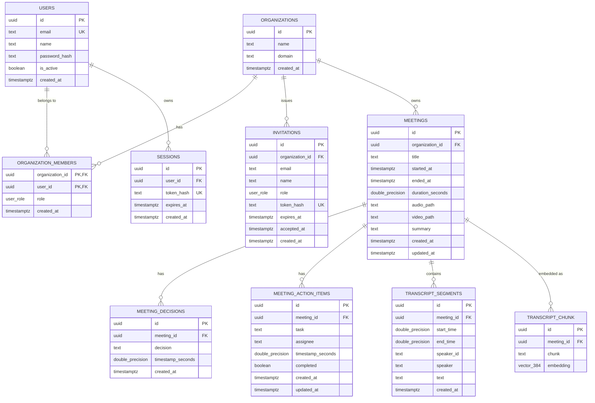

# Architecture

## 1. System Overview

AI Note Taker is a local-first meeting intelligence application. It accepts audio or video recordings, extracts audio to a standard WAV format, generates speech-to-text transcripts with speaker diarization, extracts action items and decisions, generates structured meeting summaries, and stores chunked transcript embeddings for semantic retrieval.

The system consists of three main runtime components:
1. **Frontend Desktop Application:** A desktop shell built with Wails v2 hosting a single-page React frontend. It handles user authentication, audio/screen recording via browser APIs, meeting playback, transcript browsing, speaker renaming, and task completion.
2. **Go Backend Server:** A Gin-based HTTP service running on port `8080`. It handles REST API requests, coordinates file storage, orchestrates external inference tools, manages authentication and multi-tenancy, and communicates with PostgreSQL.
3. **Inference Engines and External Processes:** A set of local CLI tools and long-running daemons combined with cloud AI APIs:
   - `ffmpeg.exe` for audio transcoding.
   - `whisper-cli.exe` (from `whisper.cpp`) for local speech-to-text.
   - `python/diarize.py` (using `pyannote.audio` 3.1) for local speaker diarization.
   - `llama-server.exe` (from `llama.cpp`) running as two local HTTP daemons: an embedding server on port `8082` and a chat server on port `8083`.
   - Google Gemini API (`gemini-3.5-flash`) for transcript chunk analysis and global meeting synthesis.
   - PostgreSQL 15+ with the `pgvector` extension for relational data and 384-dimensional vector embeddings.

---

## 2. Architecture Diagram

```mermaid
graph TB
    subgraph Client ["Client Layer"]
        ReactApp["React Frontend (Wails / Vite)"]
    end

    subgraph BackendServer ["Go Backend Server (:8080)"]
        Gin["Gin Engine / Middleware (Auth, Roles, CORS)"]
        Handlers["HTTP Handlers (Auth, Meeting, Recording, Transcript)"]
        Services["Domain & Processing Services"]
        Repos["Repository Layer (SQLC Generated)"]
    end

    subgraph Subprocesses ["Local Subprocesses & Daemons"]
        FFmpeg["ffmpeg.exe (Subprocess)"]
        Whisper["whisper-cli.exe (Subprocess)"]
        Pyannote["python/diarize.py (Subprocess)"]
        LlamaEmbed["llama-server :8082 (Embedding Daemon)"]
        LlamaChat["llama-server :8083 (Chat Daemon)"]
    end

    subgraph CloudAPIs ["Cloud AI Services"]
        Gemini["Google Gemini API (gemini-3.5-flash)"]
        HF["Hugging Face Hub (Gated Weights)"]
        Sensory["Sensory Log Server (Telemetry)"]
    end

    subgraph StorageLayer ["Persistence Layer"]
        PG[("PostgreSQL (pgvector)")]
        Disk[("Local Filesystem (audio/, recordings/, transcripts/, summaries/)")]
    end

    ReactApp -->|HTTP / Session Cookie| Gin
    Gin --> Handlers
    Handlers --> Services
    Services --> Repos
    Repos -->|pgxpool / SQL| PG

    Services -->|Exec on upload| FFmpeg
    Services -->|Exec on WAV| Whisper
    Services -->|Exec with HF_TOKEN| Pyannote
    Pyannote -.->|Download model| HF
    Services -->|HTTP POST /embedding| LlamaEmbed
    Services -.->|HTTP POST /v1/chat (Unused)| LlamaChat
    Services -->|gRPC/HTTP genai SDK| Gemini
    Handlers -->|Remote Logging| Sensory

    Services -->|Store files| Disk
```

---

## 3. Repository Structure

```text
ai_note_taker/
├── cmd/
│   └── main.go                     # Application entry point; initializes DB, services, daemons, router
├── internal/
│   ├── auth/                       # Argon2id password hashing and SHA-256 session token generation
│   ├── config/                     # Environment loading, Gemini client initialization, Sensory logger
│   ├── db/
│   │   ├── migrations/             # Up/Down SQL migration files (000001 to 000006)
│   │   ├── queries/                # SQL queries consumed by sqlc (auth, meetings, transcripts, vectors)
│   │   ├── sqlc/                   # Type-safe Go code generated by sqlc
│   │   └── postgres.go             # pgxpool connection pool setup
│   ├── diarization/                # Invokes python/diarize.py as an os/exec subprocess
│   ├── handlers/                   # Gin HTTP handlers (auth, meetings, recordings, transcripts)
│   ├── inference/                  # Profiles Whisper process memory and CPU via gopsutil
│   ├── llama/                      # Manages background llama-server processes (embedding and chat)
│   ├── middleware/                 # AuthMiddleware (session check) and RequireRoles (role enforcement)
│   ├── repository/                 # Repository layer adapting sqlc queries for handlers and services
│   ├── router/                     # Gin router, CORS, and route group definitions
│   ├── services/
│   │   ├── audio_service.go        # FFmpeg wrapper extracting 16kHz mono WAV files
│   │   ├── file_service.go         # Multipart upload handling and disk storage
│   │   ├── transcribe_service.go   # Overlap matching, chunking, embeddings, Gemini summarization, local file caches
│   │   └── db/                     # Relational domain services (AuthService, MeetingService, TranscriptService)
│   └── transcription/              # whisper.cpp invocation and AssemblyAI SDK client
├── desktop/
│   └── client/                     # Wails v2 desktop application
│       ├── app.go                  # Wails application runtime bindings
│       ├── main.go                 # Wails application entry point
│       └── frontend/               # React single-page frontend (Vite, CSS, JS/JSX)
│           └── src/
│               ├── App.jsx         # Main application shell, views, and audio player
│               ├── AuthContext.jsx # React context managing session state and /auth/me checks
│               ├── Login.jsx       # Login and initial setup forms
│               └── services/api.js # Client HTTP client using standard fetch
├── python/
│   └── diarize.py                  # Pyannote 3.1 diarization script writing JSON to stdout
├── whisper/whisper.cpp/            # Git submodule: Whisper inference source and build tree
├── llama/llama.cpp/                # Git submodule: LLaMA inference source and build tree
├── audio/                          # Extracted 16kHz mono WAV files (<meeting_id>.wav)
├── recordings/                     # Raw uploaded audio/video files (temporary)
├── transcripts/                    # Cached merged transcript JSON files (<meeting_id>_transcript.json)
├── summaries/                      # Cached meeting analysis JSON files (<meeting_id>_meeting_analysis.json)
├── sqlc.yaml                       # SQLC configuration with pgvector overrides
├── env.example                     # Reference environment configuration template
└── README.md                       # Project quick start and setup instructions
```

---

## 4. Backend Architecture

The backend follows a layered architecture:

```text
HTTP Request
     │
     ▼
Gin Router & Middleware (`internal/router`, `internal/middleware`)
     │
     ▼
HTTP Handlers (`internal/handlers`)
     │
     ▼
Domain & Coordination Services (`internal/services`, `internal/services/db`, `internal/llama`)
     │
     ▼
Repositories (`internal/repository`)
     │
     ▼
SQLC Generated Code (`internal/db/sqlc`)
     │
     ▼
PostgreSQL Database (`internal/db/postgres.go` via pgxpool)
```

### Layer Responsibilities

1. **Router & Middleware (`internal/router/router.go`, `internal/middleware/`):**
   - Configures CORS origins (`localhost:5173`, `localhost:5174`, `wails.localhost:34115`).
   - `AuthMiddleware` extracts the `session` cookie, hashes it with SHA-256, looks up the session in PostgreSQL, and injects `user_id`, `organization_id`, `user_role`, and `user_email` into the Gin context.
   - `RequireRoles` restricts endpoint access based on the injected `user_role`.

2. **HTTP Handlers (`internal/handlers/`):**
   - `AuthHandler`: Handles organization onboarding (`/auth/setup`), authentication (`/auth/login`, `/auth/logout`), session identity (`/auth/me`), member invitations, and role updates.
   - `RecordingHandler`: Handles file uploads (`/recordings`) and re-analysis triggers (`/recordings/:id/generate-ai-results`). Coordinates audio extraction, STT, diarization, chunking, embeddings, and summarization.
   - `MeetingHandler`: Manages meeting records, action items, decisions, and streams meeting WAV audio files.
   - `TranscriptHandler`: Manages individual transcript segments, meeting transcript queries, and speaker batch renaming.

3. **Services (`internal/services/`, `internal/services/db/`, `internal/llama/`):**
   - `FileService`: Validates upload size against `MAX_RECORDING_BYTES` and saves files to `recordings/`.
   - `AudioService`: Invokes FFmpeg to transcode media to 16kHz mono WAV in `audio/`.
   - `TranscribeService`: Executes `whisper-cli.exe`, parses output, merges token offsets with Pyannote speaker intervals via time-overlap calculation, chunks transcripts into 15-second windows, generates embeddings through `llama.LlamaService`, and sends chunk prompts to Google Gemini.
   - `AuthService`, `MeetingService`, `TranscriptService`: Encapsulate database transactions and business rules.
   - `LlamaService`: Starts and communicates with local `llama-server.exe` background daemons.

4. **Repository Layer (`internal/repository/`):**
   - Implements data access structs (`AuthRepository`, `MeetingRepository`, `TranscriptRepository`, `VectorRepository`) wrapping the query interface generated by `sqlc`.

5. **Data Access (`internal/db/sqlc/` & `internal/db/postgres.go`):**
   - Connects to PostgreSQL using `pgxpool.Pool` (configured with 5–25 connections).
   - `sqlc` generates type-safe Go structs and queries directly from SQL files in `internal/db/queries/`.

---

## 5. Frontend Architecture

The frontend is a single-page React 18 application located in `desktop/client/frontend/`.

- **Application Entry Point:**
  - `src/main.jsx` mounts the root React tree into `index.html`.
  - `src/App.jsx` renders `<App>`, which wraps `<AuthProvider>` and `<AuthGate>`.
- **Routing:**
  - No client-side router library (such as `react-router`) is used.
  - View navigation is managed via local React state (`view` state in `AppShell`): `'overview'`, `'meetings'`, `'actions'`, or `'settings'`.
- **Authentication State:**
  - Managed by `src/AuthContext.jsx`.
  - On mount, `AuthProvider` calls `api.auth.me()`. If valid, state becomes `'authenticated'` and loads the user object and role; otherwise, state becomes `'unauthenticated'`.
  - `<AuthGate>` displays a loading indicator, `<Login>` (if unauthenticated), or `<AppShell>` (if authenticated).
- **API Communication (`src/services/api.js`):**
  - Uses native `fetch` with `credentials: 'include'` so browser cookies are automatically sent with all requests.
  - Base URL defaults to `http://localhost:8080`, configurable via `localStorage.getItem('afterword.apiBaseUrl')`.
- **Major Components & Capabilities (`src/App.jsx`):**
  - **Meeting Recorder:** Captures audio directly from browser/desktop media devices using `navigator.mediaDevices.getUserMedia` or display capture, tracks recording duration, and uploads to `POST /api/v1/recordings`.
  - **Audio Player:** HTML5 audio playback of `/api/v1/meetings/:id/audio` synchronized with transcript timestamps. Clicking a transcript segment seeks the audio player to that timestamp.
  - **Transcript Viewer & Speaker Renaming:** Displays timestamped speaker segments. Allows editing speaker names which invokes `PUT /api/v1/meetings/:id/transcript-segments/update-speakers`.
  - **Action Items & Decisions Tracker:** Lists action items with toggleable completion states (`PATCH /api/v1/action-items/:id/complete` or `incomplete`).
  - **Summary Renderer:** Parses markdown headings and bullet lists from `meetings.summary` into structured UI blocks.

---

## 6. Authentication and Authorization

### Authentication

Authentication is stateful and cookie-based.

```text
Client                       Backend                   PostgreSQL
  │                             │                           │
  ├─── POST /auth/login ───────▶│                           │
  │    (email, password)        ├─── Verify Argon2id Hash ─▶│
  │                             ├─── Generate Random 32B ───┤
  │                             ├─── Store SHA-256 Hash ───▶│ INSERT INTO sessions
  │◀── Set-Cookie: session ─────┤                           │
  │                             │                           │
  ├─── GET /api/v1/meetings ───▶│ (AuthMiddleware)          │
  │    Cookie: session=<token>  ├─── Hash token (SHA-256) ──┤
  │                             ├─── Lookup Session User ──▶│ SELECT FROM sessions...
  │                             ├─── Set Context Keys ──────┤
  │                             ├─── Execute Handler ───────┤
  │◀── Response 200 OK ─────────┤                           │
```

1. **Setup Flow (`POST /api/v1/auth/setup`):**
   - Public route used for initial setup.
   - Takes `organization_name`, `domain`, `name`, `email`, and `password`.
   - Hashes password using Argon2id (`auth.HashPassword` with 64MB memory, 1 iteration, 4 threads).
   - Creates an organization, creates a user, links the user in `organization_members` with role `owner`, and returns HTTP 201. Does not create a session.
2. **Login Flow (`POST /api/v1/auth/login`):**
   - Takes `email` and `password`.
   - Verifies Argon2id password hash using `subtle.ConstantTimeCompare`.
   - Generates a 32-byte secure random token (`auth.GenerateToken`), computes its SHA-256 hash (`auth.HashToken`), and stores the hash in `sessions` with a 7-day expiration (`expires_at`).
   - Sets an HTTP cookie: `Name: "session"`, `HttpOnly: true`, `SameSite: Lax`, `MaxAge: 7 days`.
3. **Logout Flow (`POST /api/v1/auth/logout`):**
   - Protected route. Reads `session` cookie, computes SHA-256 hash, deletes the row from `sessions`, and clears the client cookie by setting `MaxAge: -1`.
4. **Session Verification (`GET /api/v1/auth/me`):**
   - Runs `AuthMiddleware`. Returns the authenticated user record and active organization role.
5. **Invitation Flow (`POST /api/v1/auth/invitations` & `POST /api/v1/auth/invitations/accept`):**
   - Admin/owner creates an invitation with an email, name, and role. Generates a random invitation token stored as a SHA-256 hash in `invitations`.
   - User accepts via token, sets password, creates a user account, and links into `organization_members`.

### Authorization

Authorization is separated from authentication and implemented at two tiers:
1. **Multi-Tenancy Isolation:**
   - `AuthMiddleware` retrieves `organization_id` from the session user and sets it in the Gin context.
   - Handlers extract `organization_id` and include it in database queries to ensure users can only access meetings and data belonging to their organization.
2. **Role-Based Access Control (RBAC):**
   - Roles are defined by the PostgreSQL enum `user_role`: `'owner'`, `'admin'`, `'member'`, `'viewer'`.
   - `middleware.RequireRoles(roles ...sqlc.UserRole)` checks the context `user_role`.
   - Admin routes (`/auth/invitations`, `/auth/organization/members`, `/auth/users/:id`, `/auth/users/:id/role`) require `owner` or `admin` role.

---

## 7. Data Architecture

PostgreSQL 15+ is the database, with schema managed via SQL files in `internal/db/migrations/`.



### Table Details

- `organizations`: Multi-tenant organization boundaries. Primary key `id` (UUID).
- `users`: User identity and credentials (`password_hash`). Unique on `email`.
- `organization_members`: Composite primary key `(organization_id, user_id)`. Tracks member roles.
- `sessions`: Active browser sessions. Stores `token_hash` (SHA-256). Cascades on user deletion.
- `invitations`: Pending organization invites with expiration and acceptance timestamps.
- `meetings`: Core meeting record. Foreign key `organization_id` cascades on deletion. Holds audio file path and final markdown `summary`. `video_path` exists as a column but is not currently populated by the recording handler.
- `meeting_decisions`: Decisions extracted from transcripts. Foreign key `meeting_id` cascades on delete. Indexed on `meeting_id`.
- `meeting_action_items`: Tasks, assignees, and completion boolean (`completed`). Foreign key `meeting_id` cascades on delete. Indexed on `meeting_id`.
- `transcript_segments`: Granular transcribed segments with start/end timestamps and speaker labels. Indexed on `(meeting_id, start_time)`.
- `transcript_chunk`: Chunks formatted as `[start - end] Speaker: Text` with a 384-dimensional vector embedding (`vector(384)` from `pgvector`).

---

## 8. Meeting Processing Pipeline

The end-to-end processing pipeline runs synchronously when a file is posted to `POST /api/v1/recordings`:

```text
Upload (multipart/form-data)
     │
     ▼
1. ReceiveRecording (`internal/services/file_service.go`)
   - Checks size <= MAX_RECORDING_BYTES (default 100MB)
   - Writes raw file to recordings/<uuid>.<ext>
     │
     ▼
2. ExtractAudio (`internal/services/audio_service.go`)
   - Runs ffmpeg -i <raw_file> -vn -acodec pcm_s16le -ar 16000 -ac 1 audio/<uuid>.wav
   - Inspects WAV header to calculate duration
   - Deletes original uploaded file from recordings/
     │
     ▼
3. Create Meeting Record (`internal/services/db/meeting_service.go`)
   - Inserts row into meetings with organization_id, audio_path, duration
     │
     ▼
4. Transcribe WAV (`internal/services/transcribe_service.go`)
   - Executes whisper/whisper.cpp/build/bin/Release/whisper-cli.exe
     -m whisper/whisper.cpp/ggml-tiny.en.bin -f audio/<uuid>.wav -oj
   - Reads output JSON from audio/<uuid>.wav.json
   - Profiles execution metrics (CPU %, RSS memory, RTF) via inference.CollectWhisperMetrics
     │
     ▼
5. Run Diarization (`internal/diarization/diarize.py`)
   - Runs python python/diarize.py audio/<uuid>.wav <HF_TOKEN>
   - Pyannote outputs JSON array of speaker intervals: [{start, end, speaker}]
     │
     ▼
6. Merge Transcription with Diarization (`MergeTranscriptionWithDiarization`)
   - Computes overlap between Whisper millisecond offsets and Pyannote intervals
   - Assigns dominant speaker ID (e.g. SPEAKER_00) to each segment
   - Writes cache to transcripts/<uuid>_transcript.json
   - Inserts all segments into transcript_segments table
     │
     ▼
7. Chunking & Embedding (`ChunkTranscript`)
   - Groups segments into windows up to 15 seconds
   - Formats chunk string: "[start - end] Speaker: Text"
   - Calls llama.GenerateEmbedding(chunkString) via HTTP :8082/embedding
   - Inserts chunk and 384-dimension vector into transcript_chunk table
     │
     ▼
8. Chunk Summarization (`SummarizeTranscripts`)
   - Fires concurrent goroutines for each chunk calling Google Gemini (gemini-3.5-flash)
   - Gemini returns JSON: {summary, decisions: [{text, timestamp}], action_items: [{task, assignee, timestamp}]}
   - Collects results via a Go channel
   - Writes cache to summaries/<uuid>_meeting_analysis.json
   - Inserts decisions into meeting_decisions table
   - Inserts action items into meeting_action_items table
     │
     ▼
9. Global Synthesis (`SummaryAllSummaryChunks`)
   - Concatenates chunk summaries
   - Calls Google Gemini with a synthesis prompt requesting structured sections:
     OVERVIEW, DETAILED DISCUSSION, KEY DECISIONS, ACTION ITEMS, IMPORTANT POINTS, OPEN QUESTIONS, FINAL OUTCOME
   - Updates meetings.summary column in PostgreSQL
     │
     ▼
10. Return Response
    - HTTP 201 Created with meeting ID, Whisper transcript, diarization segments, and metrics
```

---

## 9. AI/ML Components

| Component | Technology | Execution | Invocation / Boundary | Description |
|---|---|---|---|---|
| **Speech-to-Text** | `whisper.cpp` (GGML `tiny.en`) | Local binary | `os/exec` command executing `whisper-cli.exe` with `-oj` (JSON output) flag | Transcribes 16kHz WAV audio to text with millisecond token timestamps. |
| **Speaker Diarization** | `pyannote.audio` 3.1 | Local script | `os/exec` command running `python/diarize.py` passing audio path and `HF_TOKEN` | Identifies speaker turns and prints JSON segments to standard output. |
| **Embedding Model** | `bge-small-en-v1.5-q4_k_m.gguf` | Local daemon | HTTP POST to `http://localhost:8082/embedding` | Produces 384-dimensional float vector embeddings for transcript chunks and search queries. |
| **Local LLM Server** | `qwen2.5-1.5b-instruct-q4_k_m.gguf` | Local daemon | HTTP POST to `http://localhost:8083/v1/chat/completions` | Managed daemon in `llama/llama_ai.go`. `SummarizeText` method exists, but chunk summarization calls `config.Ai()` instead. |
| **Vector Storage** | `pgvector` extension | Local / Database | SQL queries with cosine distance operator `<=>` | Stores chunk embeddings in `transcript_chunk` and executes similarity searches. |
| **Cloud LLM** | Google Gemini (`gemini-3.5-flash`) | Remote Cloud API | Go SDK (`google.golang.org/genai`) using `GEMINI_API_KEY` | Generates chunk summaries, extracts structured action items and decisions, and synthesizes final meeting summary. |
| **Cloud STT (Alternative)** | AssemblyAI SDK | Remote Cloud API | Go SDK (`github.com/AssemblyAI/assemblyai-go-sdk`) | Implemented in `internal/transcription/transcribe.go` (`ExtractTextFromAudio`). Unwired in the primary recording handler. |

---

## 10. API Architecture

All endpoints are registered in `internal/router/router.go`.

### 1. Health (`/health`)
- `GET /health`: Public server health check returning `{"status":"ok"}`.

### 2. Authentication (`/api/v1/auth/*`)
- **Public:**
  - `POST /api/v1/auth/setup`: Create initial organization and owner account.
  - `POST /api/v1/auth/login`: Authenticate and issue `session` cookie.
  - `POST /api/v1/auth/invitations/accept`: Accept invitation token and create password.
- **Protected (Authenticated User):**
  - `POST /api/v1/auth/logout`: Invalidate current session and clear cookie.
  - `GET /api/v1/auth/me`: Fetch authenticated user profile and organization role.
- **Admin/Owner Only:**
  - `POST /api/v1/auth/invitations`: Generate and record a member invitation.
  - `GET /api/v1/auth/organization/members`: List all organization members.
  - `GET /api/v1/auth/users/:id`: Get user profile.
  - `PUT /api/v1/auth/users/:id`: Update user profile and active status.
  - `PATCH /api/v1/auth/users/:id/role`: Update user role (`owner`, `admin`, `member`, `viewer`).

### 3. Recordings (`/api/v1/recordings/*`)
- `POST /api/v1/recordings`: Upload a recording file. Executes complete transcription, diarization, chunking, embedding, and summarization pipeline synchronously.
- `POST /api/v1/recordings/:id/generate-ai-results`: Reads cached transcript from `transcripts/<id>_transcript.json`, regenerates chunks, embeddings, decisions, action items, and final summary for an existing meeting.

### 4. Meetings (`/api/v1/meetings/*` and `/api/v1/*`)
- `POST /api/v1/meetings`: Create a meeting record manually.
- `GET /api/v1/meetings`: List meetings for the current user's organization.
- `GET /api/v1/meetings/:id`: Retrieve meeting details and summary.
- `GET /api/v1/meetings/:id/audio`: Stream meeting WAV audio file.
- `PUT /api/v1/meetings/:id`: Update meeting details.
- `DELETE /api/v1/meetings/:id`: Delete meeting, cascaded database entries, and audio file.
- `POST /api/v1/meetings/:id/decisions`: Add decision to a meeting.
- `GET /api/v1/meetings/:id/decisions`: List decisions for a meeting.
- `DELETE /api/v1/meetings/:id/decisions`: Delete all decisions for a meeting.
- `GET /api/v1/decisions/:id`: Get a decision by ID.
- `DELETE /api/v1/decisions/:id`: Delete a single decision.
- `POST /api/v1/meetings/:id/action-items`: Add action item to a meeting.
- `GET /api/v1/meetings/:id/action-items`: List action items for a meeting.
- `GET /api/v1/meetings/:id/action-items/incomplete`: List incomplete action items for a meeting.
- `DELETE /api/v1/meetings/:id/action-items`: Delete all action items for a meeting.
- `GET /api/v1/action-items/:id`: Get an action item by ID.
- `PUT /api/v1/action-items/:id`: Update task, assignee, or timestamp.
- `PATCH /api/v1/action-items/:id/complete`: Set `completed = true`.
- `PATCH /api/v1/action-items/:id/incomplete`: Set `completed = false`.
- `DELETE /api/v1/action-items/:id`: Delete a single action item.

### 5. Transcripts (`/api/v1/meetings/:id/transcript-segments/*` and `/api/v1/transcript-segments/*`)
- `POST /api/v1/meetings/:id/transcript-segments`: Create a transcript segment manually.
- `GET /api/v1/meetings/:id/transcript-segments`: List all transcript segments for a meeting ordered by start time.
- `DELETE /api/v1/meetings/:id/transcript-segments`: Delete all segments for a meeting.
- `PUT /api/v1/meetings/:id/transcript-segments/update-speakers`: Batch rename speaker labels across both PostgreSQL and `transcripts/<id>_transcript.json`.
- `GET /api/v1/transcript-segments/:id`: Get a transcript segment by ID.
- `PUT /api/v1/transcript-segments/:id`: Update segment text or timestamps.
- `DELETE /api/v1/transcript-segments/:id`: Delete a transcript segment.

---

## 11. Background Processing and Concurrency

### Synchronous Execution
- The recording upload endpoint (`POST /api/v1/recordings`) runs synchronously within the HTTP request lifecycle. The client connection remains open while FFmpeg, Whisper, Pyannote, and Gemini execute sequentially.
- If an intermediate step fails (e.g. Pyannote failure or Whisper exit error), the handler logs the error, terminates early, and returns an HTTP error (`422 Unprocessable Entity`, `502 Bad Gateway`, or `500 Internal Server Error`).

### In-Process Goroutine Concurrency
- Concurrency is used in `transcribeService.SummarizeTranscripts`:
  ```go
  results := make(chan SummarizationResult, len(transcriptChunks))
  for i, chunk := range transcriptChunks {
      go func(index int, prompt string) {
          summarizedTranscript, err := config.Ai(prompt)
          // sends result or error to results channel
      }(i, prompt)
  }
  for range transcriptChunks {
      result := <-results
      // collects results
  }
  ```
  Each transcript chunk is submitted concurrently to the Google Gemini API in a separate goroutine. Results are synchronized back to the main thread via a buffered Go channel. If any chunk fails, an error is returned.

### Long-Running Background Processes
- `cmd/main.go` starts two daemon processes at boot via `llamaService.StartLlamaAIServer()` and `llamaService.StartEmbeddingServer()`. These use `exec.Command.Start()` without `Wait()`, running as independent background processes on ports `8083` and `8082`.

### Asynchronous Queues
- There is no persistent queue system (e.g., Redis queues, RabbitMQ, Asynq) in active use.

---

## 12. External Processes and Infrastructure

The Go application invokes and manages the following external binaries:

1. **FFmpeg (`ffmpeg.exe`):**
   - **Invocation:** Called via `github.com/u2takey/ffmpeg-go` inside `AudioService.ExtractAudio`.
   - **Arguments:** `-vn` (disable video), `-acodec pcm_s16le`, `-ar 16000` (16kHz), `-ac 1` (mono).
   - **Requirement:** `ffmpeg.exe` must be in the operating system `PATH`.
2. **Whisper CLI (`whisper-cli.exe`):**
   - **Invocation:** Called via `os/exec.Command` in `TranscribeService.TranscribeWAV`.
   - **Binary Path:** `whisper/whisper.cpp/build/bin/Release/whisper-cli.exe`.
   - **Model Path:** `whisper/whisper.cpp/ggml-tiny.en.bin`.
   - **Arguments:** `-m <model> -f <audioPath> -oj`.
   - **Metrics:** PID is captured and passed to `inference.CollectWhisperMetrics` to sample CPU usage and memory RSS via `gopsutil`.
3. **Pyannote Diarization Script (`python/diarize.py`):**
   - **Invocation:** Called via `os/exec.Command("py", "python/diarize.py", audioPath, hf_token)`.
   - **Requirement:** Python 3 available on `PATH` with `torch`, `soundfile`, and `pyannote.audio` packages installed.
   - **Communication:** Standard output JSON stream parsed via `json.Unmarshal`.
4. **LLaMA Embedding Server (`llama-server.exe`):**
   - **Invocation:** Spawned via `exec.Command.Start()` at `main.go` initialization.
   - **Binary Path:** `llama/llama.cpp/build/bin/llama-server.exe`.
   - **Model Path:** `llama/llama.cpp/models/embedding/bge-small-en-v1.5-q4_k_m.gguf`.
   - **Port:** `8082` (with `--embedding` flag).
   - **Communication:** HTTP POST to `/embedding`.
5. **LLaMA Chat Server (`llama-server.exe`):**
   - **Invocation:** Spawned via `exec.Command.Start()` at `main.go` initialization.
   - **Binary Path:** `llama/llama.cpp/build/bin/llama-server.exe`.
   - **Model Path:** `llama/llama.cpp/models/qwen/qwen2.5-1.5b-instruct-q4_k_m.gguf`.
   - **Port:** `8083`.
   - **Communication:** HTTP POST to `/v1/chat/completions`.

---

## 13. Configuration and Environment

Configuration is loaded from environment variables (and optional `.env` file via `github.com/joho/godotenv` in `internal/config/config.go` and `cmd/main.go`).

### Configuration Parameters

| Variable | Default Value | Used By | Description |
|---|---|---|---|
| `SERVER_PORT` | `8080` | `internal/config/config.go` | HTTP server port |
| `SERVER_ENV` | `development` | `internal/config/config.go` | Server environment label |
| `DB_URL` | *None* | `internal/config/config.go` | Full PostgreSQL connection string (takes precedence) |
| `DB_HOST` | `localhost` | `internal/config/config.go` | PostgreSQL host |
| `DB_PORT` | `5432` | `internal/config/config.go` | PostgreSQL port |
| `DB_USER` | `postgres` | `internal/config/config.go` | PostgreSQL username |
| `DB_PASSWORD`| *Empty* | `internal/config/config.go` | PostgreSQL password |
| `DB_NAME` | `postgres` | `internal/config/config.go` | PostgreSQL database name |
| `DB_SSL_MODE`| `disable` | `internal/config/config.go` | PostgreSQL SSL connection mode |
| `RECORDINGS_DIR` | `./recordings` | `cmd/main.go` | Temporary storage directory for incoming raw uploads |
| `MAX_RECORDING_BYTES` | `104857600` (100MB) | `cmd/main.go` | Maximum allowed recording upload size in bytes |
| `HF_TOKEN` | *None* | `internal/diarization/diarize.go` | Hugging Face token required to download Pyannote weights |
| `GEMINI_API_KEY` | *None* | `internal/config/ai_config.go` | Google Gemini API key for chunk and meeting summarization |
| `SENSORY_API_KEY`| *None* | `internal/config/sensory.go` | Sensory logging API key (falls back to NoOp if omitted) |
| `ASSEMBLYAI_API_KEY` | *None* | `internal/transcription/transcribe.go` | AssemblyAI SDK key (used in alternative transcription function) |
| `REDIS_HOST` | `localhost` | `internal/config/config.go` | Defined in config struct; not used in code |
| `REDIS_PORT` | `6379` | `internal/config/config.go` | Defined in config struct; not used in code |
| `REDIS_PASSWORD`| *Empty* | `internal/config/config.go` | Defined in config struct; not used in code |

### Hardcoded Paths & Ports

- Whisper CLI binary: `whisper/whisper.cpp/build/bin/Release/whisper-cli.exe`
- Whisper model: `whisper/whisper.cpp/ggml-tiny.en.bin`
- LLaMA binary: `llama/llama.cpp/build/bin/llama-server.exe`
- LLaMA chat model: `llama/llama.cpp/models/qwen/qwen2.5-1.5b-instruct-q4_k_m.gguf` (port 8083)
- LLaMA embedding model: `llama/llama.cpp/models/embedding/bge-small-en-v1.5-q4_k_m.gguf` (port 8082)
- Audio extraction output: `audio/<uuid>.wav`
- Transcripts directory: `transcripts/<uuid>_transcript.json`
- Summaries directory: `summaries/<uuid>_meeting_analysis.json`

---

## 14. Important Architectural Decisions

| Decision | Current implementation | Reason/evidence |
|---|---|---|
| **Local Speech-to-Text** | Local execution of `whisper.cpp` (`whisper-cli.exe`) | Eliminates per-minute cloud transcription fees and keeps audio processing on local machine. Code evidence: `TranscribeService.TranscribeWAV`. |
| **Separation of STT and Diarization** | Whisper for STT and Pyannote for diarization, joined by temporal overlap heuristic | Allows independent optimization and model swapping for transcription and speaker clustering. Code evidence: `MergeTranscriptionWithDiarization`. |
| **Dual LLaMA Background Daemons** | Spawning two separate `llama-server.exe` instances on ports 8082 and 8083 | Isolates embedding generation (`--embedding` flag on port 8082) from text generation context on port 8083. Code evidence: `internal/llama/llama_ai.go`. |
| **Hybrid Local/Cloud AI Model** | Local Whisper/Pyannote/Embeddings combined with Google Gemini for summarization | Large-context structured summarization and action item extraction benefit from high-capacity cloud LLMs, while sensitive audio transcription stays local. Code evidence: `internal/config/ai_config.go`. |
| **Unified Relational & Vector Store** | PostgreSQL 15+ using `pgvector` (`vector(384)`) | Avoids managing a separate vector database (e.g. Pinecone/Milvus) alongside user and meeting data. Code evidence: `000003_vector.up.sql`. |
| **Cookie-Based Hashed Sessions** | Random 32-byte session tokens stored as SHA-256 hashes in `sessions` table | Prevents plain-text token exposure in the database if database contents are leaked. Code evidence: `internal/auth/session.go`, `internal/middleware/auth.go`. |
| **File and Database Redundancy** | Transcripts and analyses are stored in PostgreSQL AND as JSON files on disk (`transcripts/`, `summaries/`) | Allows offline inspection and reprocessing via `generate-ai-results` without re-running transcription. Code evidence: `recording_handler.go#L244`. |

---

## 15. Known Limitations

1. **Synchronous Upload Processing:** The entire pipeline (audio extraction, Whisper, Pyannote, chunk embeddings, and Gemini summarization) executes synchronously during `POST /api/v1/recordings`. Large recordings can cause HTTP client timeouts.
2. **Missing Asynchronous Job Queue:** Redis configuration exists in `config.go`, but Redis is never connected or initialized in `main.go`. There is no persistent job queue or worker system.
3. **Hardcoded Relative Executable Paths:** Executable paths for `whisper-cli.exe`, `llama-server.exe`, and GGUF models are relative to the working directory. The backend must be started from the project repository root.
4. **Platform Coupling to Windows:** Hardcoded `.exe` binary paths (`whisper-cli.exe`, `llama-server.exe`) and invocation of the `py` launcher prevent the backend from running on Linux/macOS without code modification.
5. **Orphaned Local Processes:** `llamaService.StartLlamaAIServer()` and `StartEmbeddingServer()` call `exec.Command.Start()` but do not register process kill hooks on SIGINT/SIGTERM, which can leave orphaned `llama-server.exe` background processes running after the Go server exits.
6. **Unwired RAG Chat Endpoint:** `transcribeService.ChatWithTranscript` implements vector retrieval and answer generation, but no corresponding HTTP route exists in `router.go`.
7. **Commented Local LLM Summarizer:** `transcribeService.SummarizeTranscripts` comments out `s.llama.SummarizeText` in favor of `config.Ai()`, requiring a working `GEMINI_API_KEY` for summarization despite running a local chat daemon on port 8083.
8. **Single-Node Filesystem Dependency:** Media files, transcripts, and summaries are stored directly on the local filesystem (`audio/`, `transcripts/`, `summaries/`), preventing multi-node backend deployment.

---

## 16. Planned / Unimplemented Components

| Component | Status | Details / Evidence |
|---|---|---|
| **Semantic Q&A API Endpoint** | `Planned` | `ChatWithTranscript` is fully implemented in `internal/services/transcribe_service.go#L565` using `pgvector` distance search and Gemini context generation, but has no route in `internal/router/router.go`. |
| **Cloud Speech-to-Text Fallback** | `Planned` | `ExtractTextFromAudio` is implemented in `internal/transcription/transcribe.go` using AssemblyAI SDK, but invocation in `recording_handler.go` is commented out. |
| **Local LLM Chunk Summarization** | `Planned` | `LlamaService.SummarizeText` (calling port 8083) is implemented in `internal/llama/llama_ai.go`, but commented out in `internal/services/transcribe_service.go#L376` in favor of Google Gemini. |
| **Redis Caching / Queuing** | `Planned` | `RedisConfig` is parsed in `internal/config/config.go`, but no Redis client is initialized in `main.go`. |
| **Meeting Video Processing** | `Planned` | `video_path` exists as a column in `meetings` (from `000001_meetings.up.sql`), but the recording handler only extracts and persists audio (`audio_path`). |
| **Viewer Role Access** | `Planned` | `'viewer'` is defined in PostgreSQL enum `user_role` (`000005_auth.up.sql`), but is not handled in any role checks or frontend views. |
